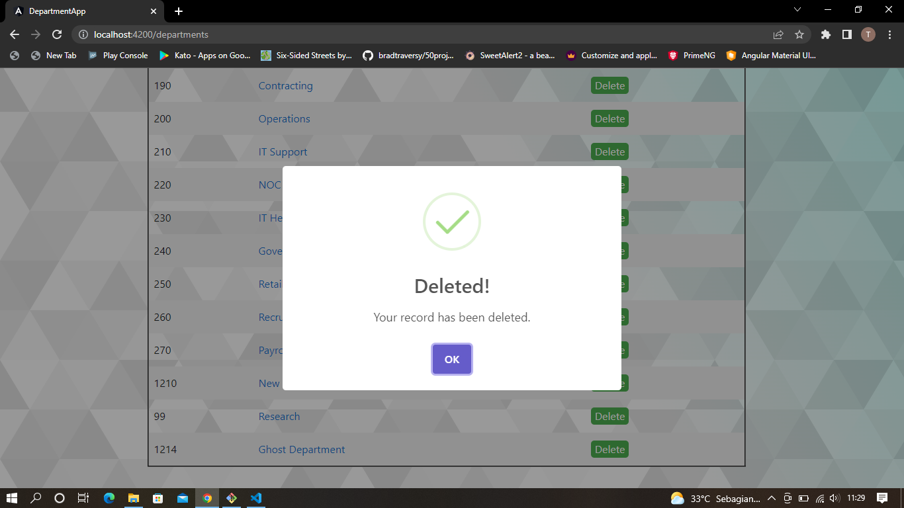

# latihan-angular
This is my Angular "Hello World". I created this repository just to learn the Angular framework. The UI looks ugly since I am too lazy to do some CSS styling or import any UI-related library except SweetAlert2. Nevertheless, the website page works!

## Features
- [x] Add new record to my department table 
- [x] Show all the records
- [x] Update existing records
- [x] Delete existing records
- [x] search records by name
- [x] validate input field

## Preview
Of course, the website page won't run well unless you can call my local API. So, here I will give some screenshots to give a glimpse of what this website page looks like.
### Home

### Adding New Department

### Updating Department

### Deleting Department

### Searching Department (By Name)

### Validating input field

### Error alert
I intentionally disabled the website service (to see the error alert) and this was the alert.

